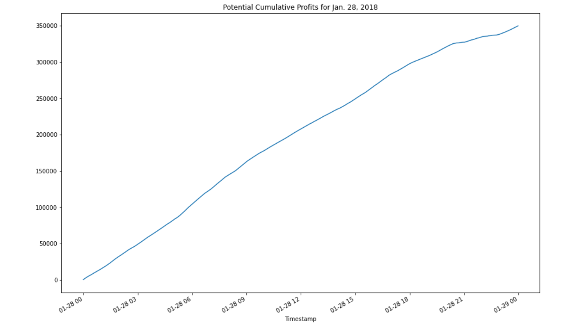
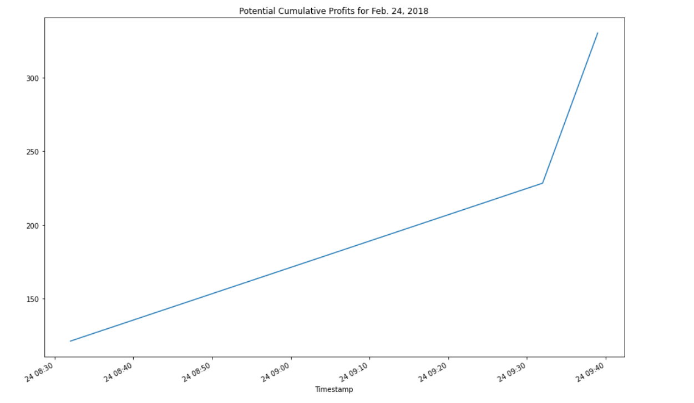
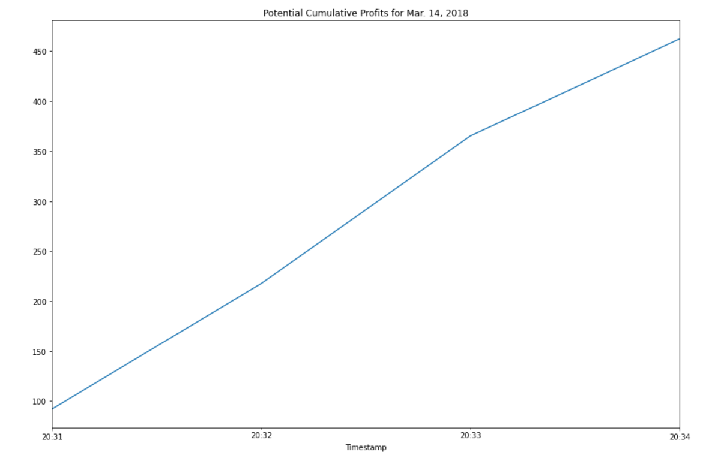

# Bitcoin Arbitrage Opportunities
An application that will perform summary analysis and plot Bitcoin arbitrage opportunities over a period of time to decide which day would produce the biggest amount of arbitrage profits. 

---

## Technologies
This project leverages python 3.7 with the following packages:

**[Pandas](https://pandas.pydata.org/)** - For financial mathematical calculations.<br> 
**[Pathlib](https://pathlib.readthedocs.io/en/pep428/)** - For working with CSV files.<br>
**[Matplotlib](https://matplotlib.org/)** - For plotting the results from our calculations.

---

## Installation Guide

Before running the application first call the following libraries:

```python
import pandas as pd
from pathlib import Path
%matplotlib inline
```

---

## Usage

To use the Bitcoin Arbitrage application simply clone the repository and run the **crypto_arbitrage.ipynb** with:

```python
python crypto_arbitrage.ipynb
```

The resulting plots will indicate the potential arbitrage profits we could have earned on that specific date:
**January 28, 2018:**

<br>

**February 24, 2018**

<br>

**March 14, 2018**



From these images we can tell that the first day of trading, Jan. 28, 2018 would have provided bigger arbitrage potential profits. 

---

## Contributors

**Created by:** Tony Landero<br>
**Email Adress:** mr.landero@gmail.com

---

